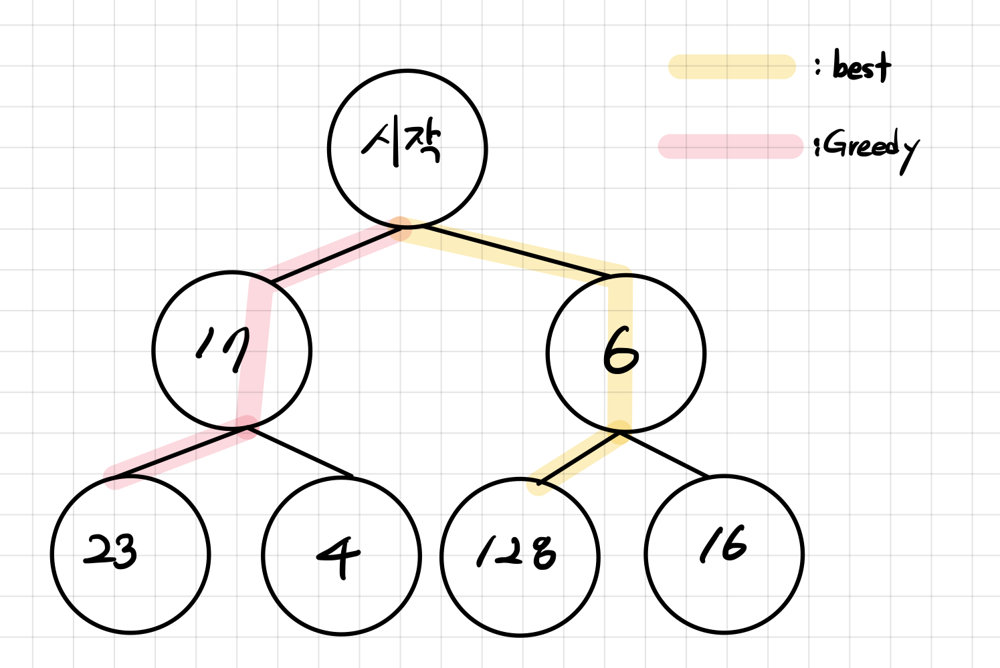

## 그리디 알고리즘, 탐욕법이란?

---

탐욕법은 최적의 값을 구해야 하는 상황에서 사용되는 근시안적인 방법론이다.

- 각 단계에서 최적이라고 생각되는 것을 선택해 나가는 방식으로 진행하여 최종적인 해답에 도달한다.
- 이때, 항상 최적의 값을 보장하는 것이 아닌, 최적의 값의 근사한 값을 목표로 한다.

### 최선의 선택이란?

그리디 알고리즘이 추구하는 가장 최선의 선택을 다음과 같은 예시를 들어 설명하면 다음과 같다.

시작 지점에서부터 시작하여 가장 큰 수를 구하는 문제가 있다고 가정하자.

- 여기서 가장 좋은 결과는 시작 → 6 → 128을 거치는 방법이 가장 큰 수를 도출한다는 것을 알 수 있다.

하지만 그리디 알고리즘은 시작 지점부터 가장 큰 수를 얻는 방법인 17을 선택하게 된다.

- 결론적으로 그리디 알고리즘은 시작 → 7 → 23을 거치는 방법이 가장 좋은 방법이라고 판단한다.
- 즉, 그리디 알고리즘은 현재 상황에서 가장 좋은 결과를 선택하는 방법이다.

때문에, 그리디 알고리즘을 사용하는 문제는 간단한 문제로 나올 가능성이 매우 크다.

## 그리디 알고리즘의 조건

---

### 1. 탐욕스러운 선택 조건

탐욕적인 선택은 항상 안전하다는 것이 보장되어야 한다.

- 여기서 안전하다는 것은 해당 선택으로 인해 전체 문제의 최적해를 반드시 도출할 수 있어야 한다.

그리디 알고리즘을 사용한다고 무조건 최적해가 나오는 것은 아니다.

하지만 그리디 알고리즘을 사용해 푸는 문제가 나왔을 때 해당 조건에 만족된다면 사용하는 것이다.

- 즉, 그리디 알고리즘을 사용하면 최적해가 나올 수 있는 문제여야 한다.

### 2. 최적 부분 구조 조건

문제에 대한 최종 해결 방법이 부분 문제에 대해서도 최적의 해결 방법이다.

- 전체 문제 안에는 여러 단계가 존재하고, 여러 단계 내의 단계에서 최적해가 도출되어야 한다.
- 즉, 그리디 알고리즘은 값들이 서로 영향을 주면 안된다는 점이다.

## 그리디 알고리즘의 단계

---

그리디 알고리즘은 매 단계마다 최적이라고 생각되는 선택을 하여 최종적으로 최적인 해답을 찾아내는 과정이다.

1. 문제의 최적해 구조를 결정한다.
2. 문제의 구조에 맞게 선택 절차를 정의한다: **선택 절차**
3. 선택 절차에 따라 선택을 수행한다.
4. 선택된 해가 문제의 조건을 만족하는지 검사한다: **적절성 검사**
5. 조건을 만족하지 않으면 해당 해를 제외한다.
6. 모든 선택이 완료되면 해답을 검사한다: **해답 검사**
7. 조건을 만족하지 않으면 해답으로 인정되지 않는다.

### 1단계: 선택 절차, Selection Procedure

해당 단계에서는 현재 상태에서 최적인 선택을 한다. 여기서 고른 선택은 이후에 바뀌지 않는다.

### 2단계: 적절성 검사, Feasibility Check

해당 단계에서는 선택한 항목이 문제의 조건을 만족시키는지 확인한다.

- 조건을 만족시키지 않으면 해당 항목은 제외된다.

### 3단계: 해답 검사, Solution Check

해당 단계에서는 모든 선택이 완료되면, 최종 선택이 문제의 조건을 만족시키는지 확인한다.

- 조건을 만족시키면 해답으로 인정된다.
